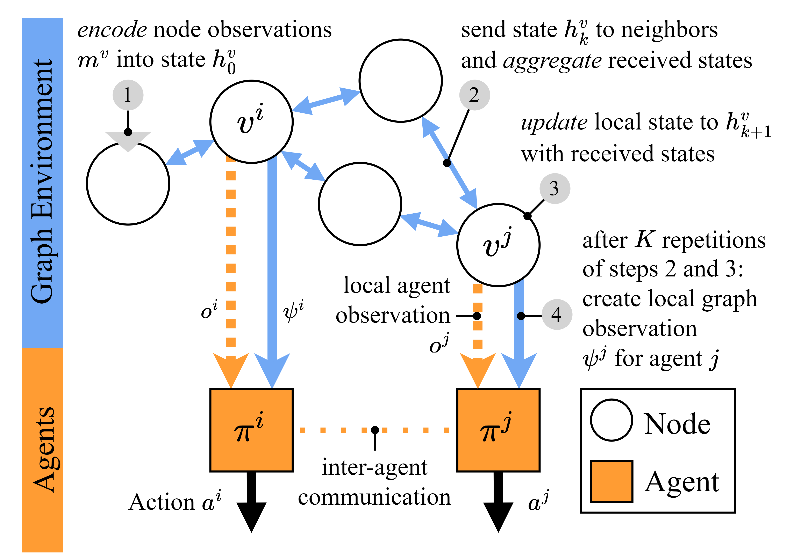

# Multi-Agent Reinforcement Learning in Graphs
[](https://github.com/psf/black)

This repository provides prototypical implementations of reinforcement learning algorithms and graph-based (multi-agent) environments.

We introduce a new environment definition in which not only the agents receive (partial) *observations*, but also all nodes in the graph receive (partial) *node observations*.
The core idea is that this allows to *decouple* learning graph representations and control tasks within the graph. Our approach leverages these local node observations and message passing to learn *graph observations*. These graph observations are then used by local agents to solve tasks that may require a broader view of the graph.



## Citation 

This is the official implementation used in the paper *Towards Generalizability of Multi-Agent Reinforcement Learning in Graphs with Recurrent Message Passing*, which has been accepted for publication at AAMAS 2024. If you use parts of this repository, please consider citing

```
@InProceedings{weil2024graphMARL,
    author    = {Weil, Jannis and Bao, Zhenghua and Abboud, Osama and Meuser, Tobias},
    title     = {Towards Generalizability of Multi-Agent Reinforcement Learning in Graphs with Recurrent Message Passing},
    booktitle = {Proceedings of the 23rd International Conference on Autonomous Agents and Multiagent Systems},
    year      = {2024},
    note      = {accepted, to appear}
}
```

## Getting started

We use [conda](https://docs.conda.io/en/latest/miniconda.html) for this guide.

1. Create a python environment and activate it
    ```
    $ conda create -n graph-marl python=3.9
    $ conda activate graph-marl
    ```

2. Optional: Install pytorch with GPU support (see https://pytorch.org/get-started/locally/). Use the CUDA version that is compatible with your GPU, e.g. for CUDA 11.8:
    ```
    (graph-marl) $ pip3 install torch torchvision torchaudio --index-url https://download.pytorch.org/whl/cu118
    ```
3. Install this package with remaining requirements (installs pytorch without GPU support if you skipped step 2). The suffix `[dev,temporal]` is optional, `dev` includes development dependencies and `temporal` includes `torch-geometric-temporal` for temporal GNN baselines. Installing the dependencies of `temporal` may take a while. 
    ```
    (graph-marl) $ pip install -e .[dev,temporal]
    ```
4. In a git repository, you can install the pre-commit hook to check formatting automatically
    ```
    (graph-marl) $ pre-commit install
    ```
5. You can start developing and training!

### Troubleshooting

#### Windows: TLS/SSL and pre-commit

On windows, you might encounter issues with `pre-commit` not being able to set up the environments due to a missing ssl Python module.

Solution: Install `pre-commit` in the `base` environment using the `conda-forge` channel (`conda install -c conda-forge pre-commit`). Then upgrade your packages in `base` via `conda upgrade --all -c conda-forge`.

## Training

The main entrypoint of this project is the file `src/main.py`.
You can get an overview of the available arguments with

```
(graph-marl) $ python src/main.py --help
```

Note that not all combinations of the available arguments have been thoroughly tested.

### Minimal Example Environment

We provide a minimal example environment (`--env-type=simple`) that converges very quickly and allows to test the implementation.

You can run regular DQN on the environment like
```
(graph-marl) $ python src/main.py --device=cuda --step-before-train=1000 --total-steps=2000 --eval-episodes=10 --env-type=simple --model=dqn
```

and enable learned graph observations by adding `--netmon`, resulting in
```
(graph-marl) $ python src/main.py --device=cuda --step-before-train=1000 --total-steps=2000 --eval-episodes=10 --env-type=simple --model=dqn --netmon
```

The latter will take longer to train, but the evaluation after training should yield the optimal mean reward of 
```
{
    "reward_mean": 1.0
}
```

If your system does not support cuda, you can replace `--device=cuda` with `--device=cpu`.

### Routing in Single Graphs

All routing experiments are initiated by calling `src/main.py`.
An exemplary configuration to train a DQN agent for routing in single graphs with seed 923430603 (from the test graphs) is

```
(graph-marl) $ python src/main.py --seed=0 --topology-init-seed=923430603 --train-topology-allow-eval-seed --episode-steps=300 --model=dqn --random-topology=0 --gamma=0.9 --epsilon=1.0 --hidden-dim=512,256 --mini-batch-size=32 --device=cuda --lr=0.001 --tau=0.01 --step-before-train=10_000 --capacity=200_000 --eval-episodes=1000 --eval-episode-steps=300 --step-between-train=10 --total-steps=250_000 --comment=fixed-dqn-t923430603
```

The environment variant without bandwidth limitations can be enabled with `--no-congestion `.

The experiments from our paper are provided with `scripts/start_routing_runs.sh`.

### Supervised Learning on Shortest Path Lengths

The script `src/sl.py` allows to train different graph observation architectures on a supervised routing task.
In the first run, the script will generate a dataset.
The dataset is saved locally, subsequent runs load it automatically.
An exemplary configuration with our architecture is 

```
(graph-marl) $ python src/sl.py --seed=0 --netmon-iterations=1 --sequence-length=8 --iterations=50_000 --num-samples-train=99_000 --validate-after=500 --filename=netmon-1it-8seq-0.h5
```

Note that generating data for 100_000 topologies will take some time. Dataset generation is not parallelized at the moment and will take around 5-15 minutes depending on the CPU.

The argument `--netmon-iterations` stands for the number of message passing iterations.
The argument `--sequence-length` determines the unroll length during training.
To use other architectures, one can set the `--netmon-agg-type` argument, e.g. to `gconvlstm` for GCRN-LSTM.
Optionally, the argument `--clear-cache` can be used to force the generation of new datasets.

The experiments from our paper are provided with `scripts/start_sl_runs.sh` (note that the dataset has to be generated first). If you want to perform parallel training runs, make sure that the dataset is generated
*before* launching the runs.

### Generalized Routing

An exemplary configuration to train our approach is

```
(graph-marl) $ python src/main.py --netmon-agg-type=sum --netmon-rnn-type=lstm --netmon-iterations=1 --sequence-length=8 --seed=0 --step-between-train=10 --total-steps=2_500_000 --netmon --model=dqn --random-topology=1 --gamma=0.9 --epsilon=1.0 --epsilon-decay=0.999 --hidden-dim=512,256 --netmon-encoder-dim=512,256 --netmon-dim=128 --mini-batch-size=32 --device=cuda --lr=0.001 --tau=0.01 --step-before-train=100_000 --capacity=200_000 --eval-episodes=1000 --eval-episode-steps=300 --episode-steps=50 --comment=dynamic-netmon-1it-8seq
```

The argument `--netmon` enables graph observations.
Note that a replay memory with capacity `200_000` requires around 30 GB of RAM.
To reduce the memory requirements, you can reduce the precision of the replay memory (not of the model) with `--replay-half-precision`.
The evaluation after training is performed over the 1000 test graphs.

The experiments from our paper are provided with `scripts/start_routing_netmon_runs.sh`.

## Development with Visual Studio Code

This repository contains settings and recommended extensions for [Visual Studio Code](https://code.visualstudio.com/) in `.vscode/`.
When opening the project with vscode, you should get a prompt to install the recommended packages. The settings should be applied automatically.

### Select Python Interpreter

To get syntax highlighting to work properly, you have to select the correct Python interpreter.
This can be done by opening the vscode command palette (usually Control+Shift+P or F1) and typing `Python: Select Interpreter`. Select the previously created `ac3net` conda environment and you are done.

### Viewing Tensorboard Logs

We automatically save tensorboard logs and models in new subdirectories inside `runs/`.

You can view them by running `tensorboard --logdir=runs`.

Alternatively, you can run the command `Python: Launch Tensorboard` in vscode.

## Acknowledgement

This work has received funding from the Federal Ministry of Education and Research of Germany ([BMBF](https://www.bmbf.de/)) through Software Campus Grant 01IS17050 (AC3Net).

Repository logo by Alisha Hirsch.